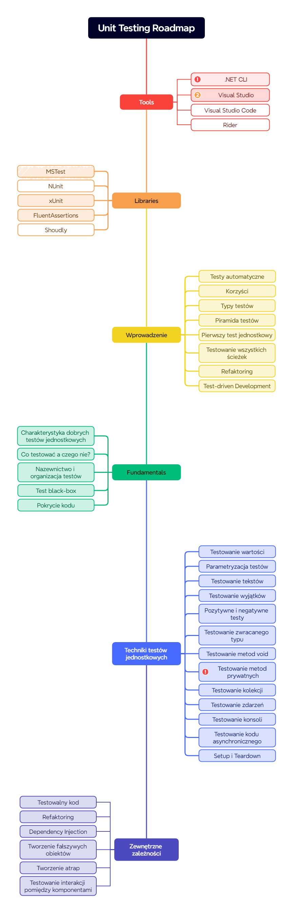

# Przykłady ze szkolenia TDD

## Wprowadzenie

Witaj w repozytorium z materiałami do szkolenia **TDD**.

Do rozpoczęcia tego kursu potrzebujesz następujących rzeczy:

1. [.NET 8 SDK](https://dotnet.microsoft.com/en-us/download/dotnet/8.0).

## Przygotowanie
1. Sklonuj repozytorium Git
```
git clone https://github.com/sulmar/nobleprog-merrid-tdd
```
2. Zbuduj
```
cd src
dotnet test
```

## Zakres

